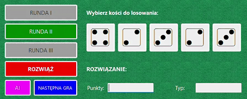

# Poker Dice (Interpreter)
Wykorzystanie wzorca Interpreter do stworzenia prostej gry w kości pokerowe z polskim systemem punktacji oraz z asystentem AI.

# Klasyfikator
LightGBM

# Przykład użycia

